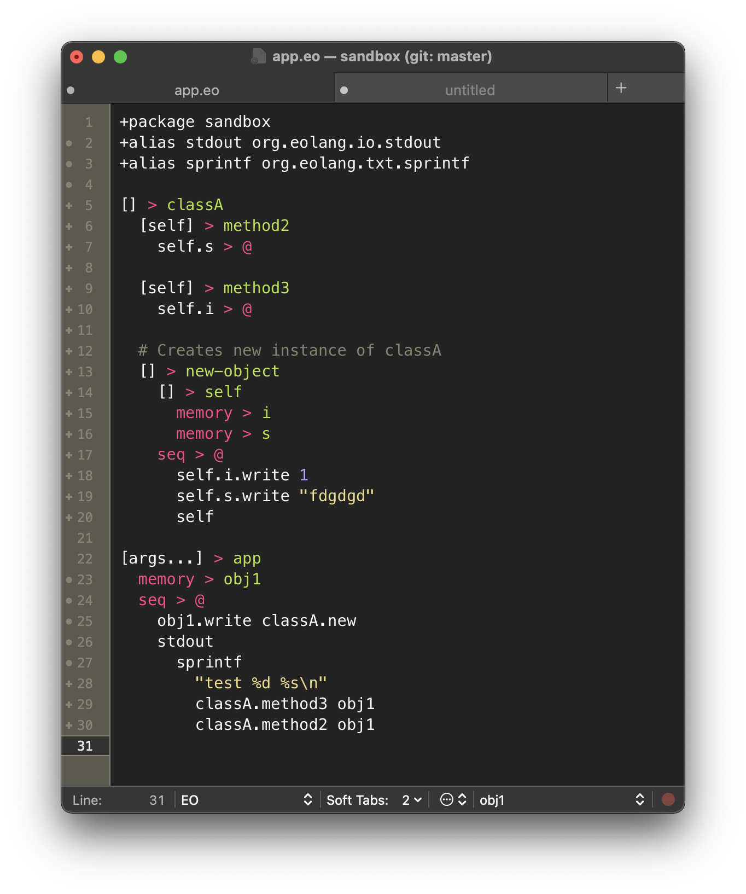
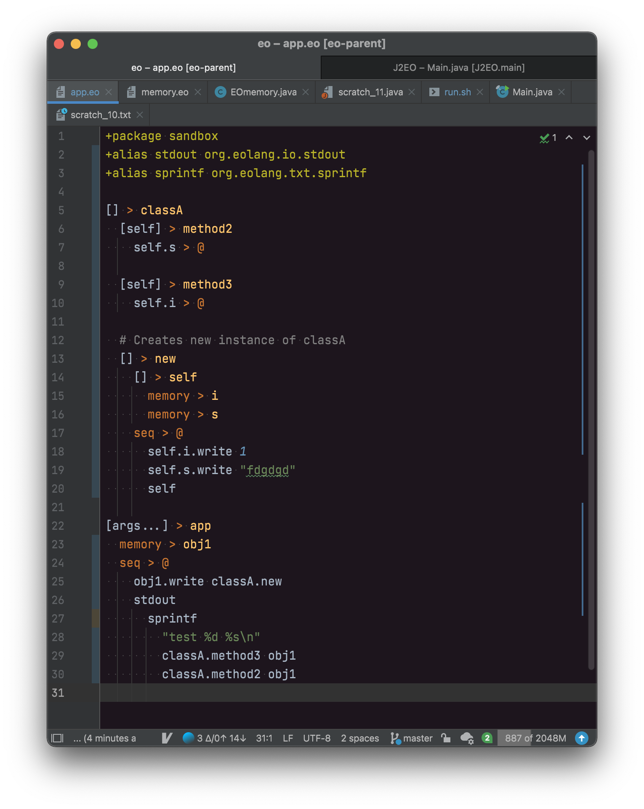

# TextMate Bundle for EOLANG

Simple grammar definition for TextMate EOLANG syntax highlighting. More features may be added later.

## Installation

### TextMate

Clone the repo into TextMate bundles directory. It should be automatically available after that.

```shell
mkdir -p ~/Library/Application\ Support/TextMate/Bundles
git clone https://github.com/IamMaxim/eo.tmbundle ~/Library/Application\ Support/TextMate/Bundles/EO.tmbundle
``` 

### Intellij IDEA

It is also possible to install this package for Intellij IDEA:
 - Ensure TextMate plugin for IDEA is installed.
 - Go to Preferences — Editor — TextMate Bundles
 - Click + and choose the .tmbundle directory.

## Showcase



